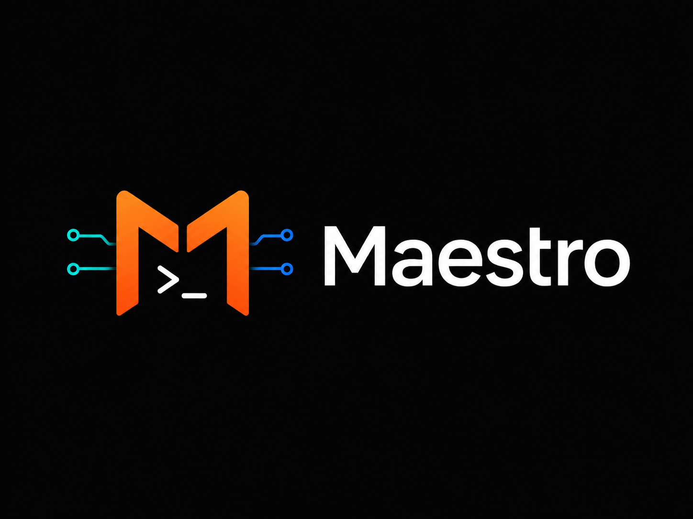
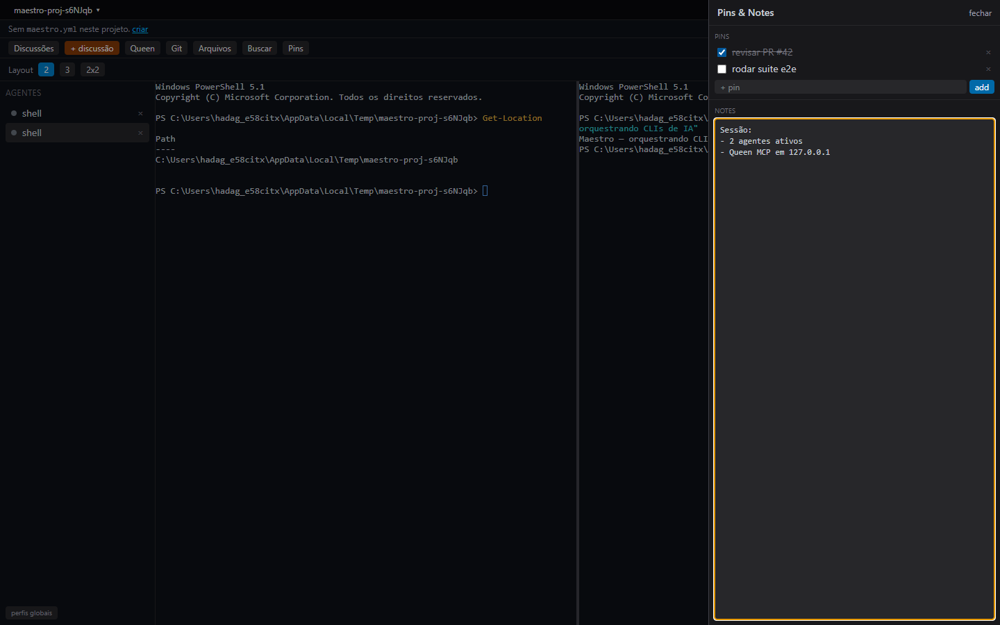

<p align="center">
  
</p>

<p align="center">
  <b>Orquestre vários CLIs de IA num grid de terminais reais — mais orquestração multi-agente.</b>
</p>

<p align="center">
  
  
  
</p>

<p align="center">
  
</p>

Maestro é um app desktop (Electron + React) para rodar e coordenar várias ferramentas de linha de comando de IA (Claude, Codex, Antigravity, etc.) lado a lado, em terminais de verdade. Inspirado no HiveTerm, é marca própria e open-source.

## ✨ Recursos

- **Grid de terminais reais** — múltiplos PTYs (node-pty + xterm.js) em layouts redimensionáveis (2 / 3 / 2×2).
- **Perfis de CLI + `maestro.yml`** — presets + perfis globais + por-projeto, com *workspace trust* estilo VS Code (spawns de origem-projeto só rodam em pastas confiáveis).
- **Discussões / orquestração** — engine que faz vários CLIs debaterem um tópico (decisão, brainstorm, review, plano, dev-squad) via invocações headless.
- **Queen (servidor MCP embutido)** — ~24 ferramentas MCP (loopback, bearer token) para um agente controlar terminais, discussões, sub-agentes, pins/notes.
- **Árvores de sub-agentes** — um agente pode spawnar filhos e aguardar conclusão; a sidebar mostra a hierarquia.
- **Painel Git** — status/diff/stage/commit/push/PR (via `git`/`gh`), com "Ask AI" para sugerir a mensagem de commit.
- **Busca de arquivos** — finder fuzzy (Ctrl+P) e busca em conteúdo (Ctrl+Shift+F) respeitando `.gitignore`, com highlight (Shiki).
- **Pins & Notes** — checklist + scratchpad por-projeto, editáveis pela UI **ou** por agentes via MCP (atualiza ao vivo).
- **Confiabilidade** — auto-restart de terminal (cap + backoff), cascade-kill de sub-agentes, notificação nativa quando a IA **conclui uma tarefa** (sinal OSC/bell + inatividade, só em background).

## 📦 Instalação

### Windows (instalador)
Baixe o `Maestro-Setup-<versão>.exe` na página de [Releases](../../releases) e execute. O instalador adiciona o comando **`maestro`** ao PATH do usuário.

### Comando `maestro`
Depois de instalar (ou via *from source* abaixo):

```sh
maestro            # abre o app
maestro .          # abre o app com a pasta atual como projeto
maestro C:\proj    # abre o app com essa pasta como projeto
```

Uma segunda invocação foca a janela já aberta (instância única).

### From source
```sh
git clone https://github.com/hadagalberto/maestro.git
cd maestro
npm install
npm run build
npm link           # disponibiliza o comando `maestro` no terminal (dev)
maestro
```
Ou, sem `link`, rode em modo dev: `npm run dev`.

## 🧩 `maestro.yml`

Coloque na raiz do projeto para definir perfis de CLI:

```yaml
version: 1
defaultProfile: claude
profiles:
  claude:
    command: claude
    autoStart: true
  codex:
    command: codex
  antigravity:
    command: agy
```

A pasta precisa ser **confiável** para rodar perfis de origem-projeto (a UI pede confirmação).

## 🐝 Queen (MCP)

Cada terminal recebe `MAESTRO_MCP_URL` / `MAESTRO_MCP_TOKEN` no ambiente. Um agente de IA conecta nesse servidor MCP local para listar/abrir/escrever em terminais, iniciar discussões, spawnar sub-agentes e ler/escrever pins & notes. O painel **Queen** mostra a URL, o token e um snippet de conexão.

**Auto-conexão:** ao abrir um terminal, o Maestro já configura o CLI para conectar na Queen, com a estratégia que cada um suporta de forma não-interativa — `claude` via `--mcp-config`, `codex` via `-c mcp_servers`, `opencode` via `OPENCODE_CONFIG_CONTENT`, e `gemini`/`amp`/`antigravity` escrevendo um arquivo de config por-projeto (merge-safe, adicionado ao `.gitignore`). O token vem do ambiente (`${MAESTRO_MCP_TOKEN}`), nunca do argv — exceto no Antigravity, que não expande env e recebe o token no arquivo gitignored.

## 🛠️ Desenvolvimento

| Script | O que faz |
|---|---|
| `npm run dev` | app em modo dev (HMR) |
| `npm run build` | build de produção (`out/`) |
| `npm run typecheck` | TypeScript estrito |
| `npm run test:unit` | testes unitários (vitest) |
| `npm run test:component` | componentes (vitest browser mode) |
| `npm run test:e2e` | end-to-end (Playwright `_electron`) |
| `npm run package` | gera instaladores em `release/` (electron-builder) |

**Stack:** Electron 42 · electron-vite · React 19 · TypeScript · Tailwind 4 · zustand · zod · node-pty · @xterm/xterm · @modelcontextprotocol/sdk.

## 📥 Release / build de instaladores

`npm run package` constrói para a plataforma atual. O workflow [`.github/workflows/release.yml`](.github/workflows/release.yml) gera instaladores Windows/macOS/Linux e anexa a um GitHub Release ao publicar uma tag `v*`.

## 📄 Licença

[MIT](LICENSE) © 2026 Hadagalberto Junior.

Inclui o plugin NSIS [EnVar](https://github.com/GsNSIS/EnVar) (domínio público) para integração de PATH no instalador Windows.
